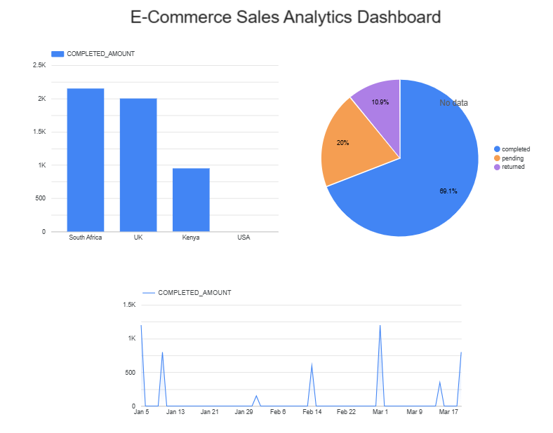

# E-Commerce Analytics Pipeline | dbt + Snowflake

## Project Overview
An end-to-end analytics engineering project built on a modern data stack. 
Raw e-commerce data is transformed through a layered architecture into 
business-ready models using dbt and Snowflake.

## Tech Stack
- **Snowflake** — Cloud data warehouse
- **dbt Core** — Data transformation & testing
- **Git/GitHub** — Version control

## Architecture
raw (Snowflake) → staging (dbt) → marts (dbt)

## Models
### Staging
| Model | Description |
|-------|-------------|
| stg_customers | Cleaned customer data with full_name |
| stg_orders | Cleaned orders with completed_amount |
| stg_products | Cleaned product data |

### Marts
| Model | Description |
|-------|-------------|
| mart_sales | Joined sales view combining customers and orders |

## Testing
7 data quality tests including:
- Unique and not_null checks on primary keys
- Accepted values validation on order status

## Dashboard
Built in both Power BI and Looker Studio connecting directly to Snowflake.

## How to Run
1. Clone this repo
2. Install dbt: `pip install dbt-snowflake`
3. Configure your Snowflake credentials in `~/.dbt/profiles.yml`
4. Run `dbt run` to build models
5. Run `dbt test` to validate data quality