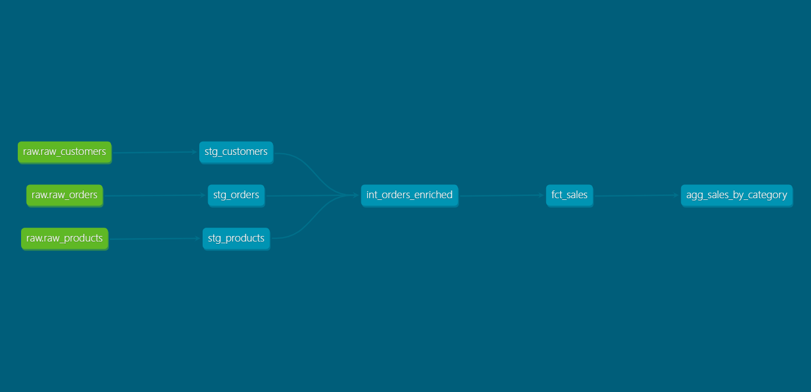

# E-Commerce Analytics Pipeline | dbt + Snowflake

## Project Overview

An end-to-end analytics engineering project built on a modern data stack. Raw e-commerce data flows through a layered medallion architecture and lands in business-ready models that power dashboards in both Power BI and Looker Studio.

The project was built to practice the patterns I'd expect to see in a real analytics engineering role: medallion layering, modular dbt models, foreign key tests, and version-controlled documentation.

## Tech Stack

- **Snowflake** — cloud data warehouse
- **dbt Core** — transformations, tests, documentation
- **Power BI** and **Looker Studio** — dashboard layer
- **Git / GitHub** — version control

## Architecture

The project follows a medallion architecture — bronze (sources), silver (staging + intermediate), gold (marts):

| Layer | Purpose | dbt equivalent |
|---|---|---|
| Bronze | Raw, untouched source tables | `_sources.yml` |
| Silver — staging | One model per source; cleaned, renamed, typed | `stg_*.sql` |
| Silver — intermediate | Joins and enrichment between cleaned entities | `int_*.sql` |
| Gold — marts | Business-ready data products consumed by BI | `fct_*.sql`, `agg_*.sql` |

Data flows in one direction only — no layer reads from a layer above it.

## Models

### Staging (silver)

| Model | Description |
|---|---|
| `stg_customers` | Cleaned customer data with derived `full_name` |
| `stg_orders` | Cleaned orders with derived `completed_amount` |
| `stg_products` | Cleaned product catalogue |

### Intermediate (silver)

| Model | Description |
|---|---|
| `int_orders_enriched` | Orders joined with customer and product details |

### Marts (gold)

| Model | Description |
|---|---|
| `fct_sales` | Order-grain fact table — one row per order, fully enriched |
| `agg_sales_by_category` | Monthly sales aggregated by country and product category |

## Materialisation Strategy

Configured in `dbt_project.yml`:

- **Staging and intermediate** → views (cheap, always fresh)
- **Marts** → tables (pre-computed for fast dashboard queries)

## Testing

23 data quality tests run via `dbt test`, including:

- `unique` and `not_null` on every primary key
- `relationships` tests enforcing foreign keys between orders, customers, and products
- `accepted_values` on `order.status`
- Source-level tests on raw tables to catch issues before they flow downstream

## Data Lineage

*Auto-generated by `dbt docs generate`. Shows dependencies from sources through staging, intermediate, and marts.*

## Dashboard

Two dashboards were built on top of the gold layer, both connecting directly to Snowflake:

- **Power BI** — primary dashboard for sales analysis (`ecommerce_dashboard.pbix`)
- **Looker Studio** — lighter-weight web-based view of the same metrics

## How to Run

1. Clone this repo
2. Install dbt: `pip install dbt-snowflake`
3. Configure your Snowflake credentials in `~/.dbt/profiles.yml`
4. Run `dbt run` to build models
5. Run `dbt test` to validate data quality
6. Run `dbt docs generate && dbt docs serve` to view documentation

## What I'd Improve Next

- **Separate dbt schema from source schema** — currently both live in `RAW`. The standard pattern is to keep raw sources read-only in a `RAW` schema and write dbt outputs to a dedicated `ANALYTICS` schema.
- **Add incremental models** — `fct_sales` rebuilds in full on every run. With realistic data volumes, this should switch to incremental.
- **CI/CD via GitHub Actions** — auto-run `dbt build` on pull requests against a CI Snowflake schema.
- **Expand the dimensional model** — currently order-centric. A real retail project would add stores, time, and promotions dimensions.
